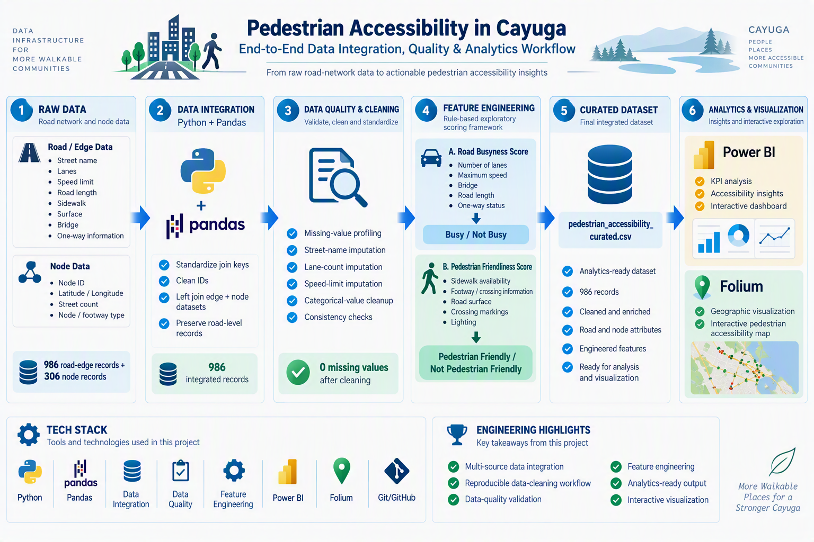

# Pedestrian Accessibility in Cayuga

An end-to-end data integration and analytics project that evaluates road and pedestrian accessibility characteristics in Cayuga.

The project combines road-segment and node datasets, performs data-quality checks and cleaning, engineers rule-based accessibility metrics, and produces analytics-ready data for Power BI and interactive geographic visualization with Folium.

## Project Overview

Pedestrian accessibility depends on several road characteristics, including sidewalks, crossings, road speed, lighting, surface conditions, and traffic-related attributes.

This project builds a reproducible data workflow to:

- integrate road and node datasets
- identify and handle missing data
- standardize attributes for analysis
- engineer road-busyness and pedestrian-friendliness metrics
- create an analytics-ready dataset
- visualize accessibility results using Power BI and Folium

> **Note:** The scoring methodology is an exploratory, rule-based analytical framework and should not be interpreted as a scientifically validated pedestrian-safety measure.



---

## Data Pipeline

```text
Raw Road Data          Raw Node Data
      |                       |
      +----------+------------+
                 |
                 v
          Data Integration
           Python / Pandas
                 |
                 v
        Data Quality Profiling
                 |
                 v
       Cleaning & Imputation
                 |
                 v
         Feature Engineering
                 |
     +-----------+-----------+
     |                       |
     v                       v
Road Busyness Score    Pedestrian-Friendly
                            Score
     +-----------+-----------+
                 |
                 v
       Curated Dataset
                 |
        +--------+--------+
        |                 |
        v                 v
     Power BI          Folium Map
```

---

## Dataset Integration

The workflow integrates two source datasets.

### Road / Edge Data

Contains road-segment attributes such as:

- street name
- lanes
- maximum speed
- road length
- one-way status
- bridge information
- sidewalk availability
- surface characteristics
- crossing information
- lighting

### Node Data

Contains intersection/node-level information including:

- node identifier
- latitude
- longitude
- street count
- node type

The integration workflow standardizes the source identifiers and performs a left join between road-edge and node data.

**Input size:**

- 986 road-edge records
- 306 node records

**Integrated dataset:**

- 986 road-level records

---

## Data Quality & Transformation

The pipeline profiles missing values before transformation and applies rule-based cleaning and imputation.

Key operations include:

- join-key standardization
- missing-value profiling
- missing street-name handling
- lane-count imputation
- maximum-speed imputation
- categorical-value cleanup
- post-cleaning missingness validation

The resulting dataset contains no remaining missing values in the fields used by the workflow.

---

## Feature Engineering

### Road Busyness Score

A rule-based `busy_score` is derived using attributes including:

- number of lanes
- maximum speed
- bridge status
- road length
- one-way status

Roads are subsequently categorized as `Busy` or `Not Busy`.

### Pedestrian Friendliness Score

A `pedestrian_friendly_score` is calculated using characteristics such as:

- sidewalk availability
- footway / crossing information
- surface type
- crossing markings
- lighting

Road segments are then categorized as `Pedestrian Friendly` or `Not Pedestrian Friendly`.

These scores are designed for exploratory analysis rather than as validated safety ratings.

---

## Interactive Geographic Visualization

Folium is used to create an interactive geographic visualization based on the latitude and longitude associated with the integrated road data.

Road locations are represented using color-coded markers based on their pedestrian-friendliness score.

The generated map is available at:

`outputs/pedestrian_safety_map.html`

> Map background tiles are provided by an external map-tile service and may occasionally be unavailable or rate-limited independently of the project.

---

## Power BI Analysis

The curated dataset can be explored through the included Power BI dashboard.

The dashboard file is located at:

`dashboard/pedestrian_accessibility_powerbi.pbix`

The dashboard supports analysis of road and pedestrian-accessibility characteristics from the transformed dataset.

---

## Repository Structure

```text
Pedestrian-Accessibility-in-Cayuga/
├── assets/
│   └── cayuga_data_pipeline.png
├── data/
│   ├── raw/
│   │   ├── edges.csv
│   │   └── nodes.csv
│   └── processed/
│       └── pedestrian_accessibility_curated.csv
├── notebooks/
│   └── pedestrian_accessibility_etl.ipynb
├── outputs/
│   └── pedestrian_safety_map.html
├── dashboard/
│   └── pedestrian_accessibility_powerbi.pbix
├── README.md
├── requirements.txt
└── .gitignore
```

---

## Technology Stack

**Data Processing**
- Python
- Pandas

**Data Engineering**
- Data Integration
- Data Cleaning
- Data Transformation
- Data Quality Validation
- Feature Engineering

**Analytics & Visualization**
- Power BI
- Folium

**Development**
- Jupyter Notebook
- Git
- GitHub

---

## Running the Project

### 1. Clone the repository

```bash
git clone https://github.com/Narang-Garima/Pedestrian-Accessibility-in-Cayuga.git
cd Pedestrian-Accessibility-in-Cayuga
```

### 2. Install dependencies

```bash
pip install -r requirements.txt
```

### 3. Run the ETL notebook

Open:

`notebooks/pedestrian_accessibility_etl.ipynb`

Restart the kernel and run all cells.

The workflow generates:

- `data/processed/pedestrian_accessibility_curated.csv`
- `outputs/pedestrian_safety_map.html`

---

## Key Engineering Highlights

- Multi-source dataset integration
- Reproducible raw-to-curated data workflow
- Missing-data profiling and imputation
- Data-quality validation
- Rule-based feature engineering
- Analytics-ready dataset generation
- Power BI downstream analytics
- Interactive geographic visualization

---

## Project Workflow

**Raw Data → Integration → Data Quality → Cleaning → Transformation → Feature Engineering → Curated Data → Analytics & Visualization**
